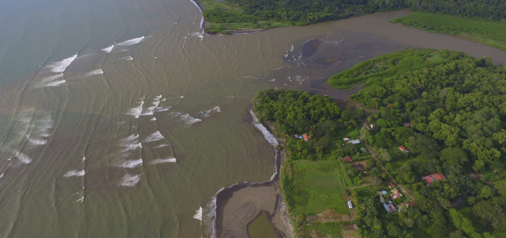
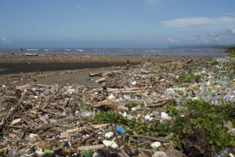
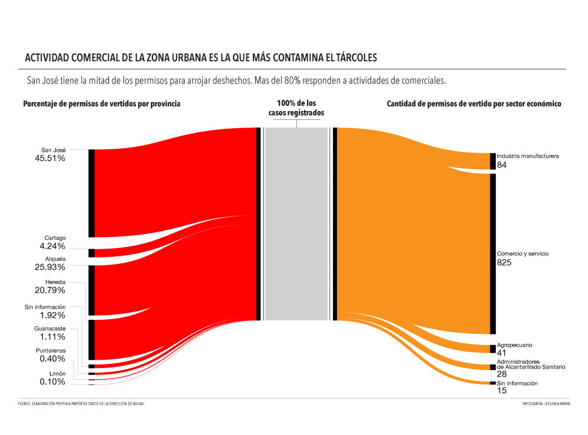

Por [Angélica Castro](http://www.puntoyaparte-ca.com/staff/angelica-castro-camacho/).


```{r, out.width = 800, echo = FALSE}

knitr::include_url("https://uploads.knightlab.com/storymapjs/a88c02649f3f2466556e0105a1ed96ce/tarcoles-pasos-de-gigante/index.html",
                   height = 800)

```

Navegar de madrugada por la calma transparente del Grande de Tárcoles el sonido de la vida despertando con la mañana diluye el recuerdo de la basura, el olor a animal muerto; y es casi imposible creer que cientos de kilómetros corriente arriba se concentra el extracto podrido de todo lo que desecha una ciudad.


```{r, echo=FALSE, out.width="95%"}

```


El crecimiento urbano desmedido, el uso indiscriminado de la tierra, las toneladas de basura que le arrojamos y –principalmente- el constante chorro de aguas contaminadas que se lanzan a su torrente, ahogan al río que atraviesa toda nuestra ciudad, y obtenemos el vergonzoso título de haber creado el cauce más contaminado de Centroamérica.


El nombre de Grande no le queda corto al Tárcoles. Con un 4.2% del territorio nacional y más de 30 afluentes, nace en diversos puntos de la Cordillera Volcánica Central y se extiende por más de 2000 kilómetros. Pasa por San José, Alajuela, Heredia, Cartago y Puntarenas, por hogares que conforman cerca del 60% de la población; hasta desembocar en el Golfo de Nicoya, en Playa Azul y Guacalillo. Pocos conocen al país como él.


Basta un paseo por sus orillas para evidenciar las secuelas que tanta irresponsabilidad le deja: basura en todas las formas, colores y tamaños. Pañales, cocinas, arapos, latas, bicicletas, un pollo de peluche, televisores y una plaga de botellas decoran su paisaje irregular. Pero esa no es la peor noticia.


El depósito de las aguas negras y residuales, domésticas e industriales, de cerca del 67% del Valle Central son el problema más grave y complejo detrás los desperdicios.


En ríos que se usan para riego e incluso para agua potable, se vierten directamente heces, orines, aguas jabonosas, aceites, medicamentos y toda clase de residuos de procesos industriales sin tratamiento alguno.


De 3.500 industrias ubicadas en los ríos que drenan en el Golfo de Nicoya, solo 175 cuentan con plantas de tratamiento, según datos de 2002. Esto coincide con los 250.000 metros cúbicos de aguas residuales sin tratamiento que caen al Tárcoles por día, según Acueductos y Alcantarillados (AyA). Ese es el equivalente a volcar todos los días 100 piscinas olímpicas de aguas sucias.


Solo en el río Virilla, uno de sus principales afluentes, hay niveles de contaminación de moderado a severo en casi un 60% de las aguas, según un estudio publicado en 2010 por el Laboratorio de Análisis Ambiental de la Universidad Nacional (UNA). Esta investigación también señaló un alarmante aumento de entre 5% y 17% por año en la contaminación.


# Cuando ya no se puede más

La suciedad en la desembocadura del Tárcoles es comparable al vómito de un enfermo que intenta curarse el cuerpo demasiado tarde. En Playa Azul y Guacalillo, donde desemboca, se reflejan las arcadas brutales que da el río para sacar de sus aguas las chancletas, llantas, animales muertos, juguetes, árboles y botellas desechables que a alguien le estorbaron. Se quita la basura, porque el agua descompuesta entra al Pacífico sin que nadie pueda evitarlo.

Oscar Agüero Ríos vive en la orilla del Tárcoles hace casi 40 años y hace una confesión que cuesta comprender: está enamorado del lugar por su belleza natural. Para él y la mayoría de los habitantes de las comunidades ubicadas en la desembocadura, el río representa una fuente de trabajo, principalmente a través de la pesca y el turismo.

Pero en los paseos turísticos en lancha que realiza Agüero junto a su hijo, ni el paisaje ni los cocodrilos pueden opacar las manchas de suciedad. Tratan de llevar a los pasajeros a lugares limpios, pero a veces no hay forma de ocultar las refrigeradoras flotantes.

“Me da mucha tristeza cuando los visitantes vienen y hacen chistes del tema. Y nos hablan de que Playa Azul y Guacalillo son almacenes de línea blanca, porque ahí nos llegan lavadoras, televisores viejos y todo lo que se pueda pensar” cuenta Damaris Arriola, vicealcaldesa de Garabito.


<iframe src="https://www.youtube.com/embed/PGXVJx1DwbM" width="100%" height="450" frameborder="0" allowfullscreen="allowfullscreen"></iframe></p>

En 2007 un vecino del cantón, harto del desprecio y la irresponsabilidad de la Meseta Central, puso un recurso de amparo contra el Ministerio de Ambiente y Energía (Minae), Ministerio de Salud, AyA, Caja Costarricense del Seguro Social y las 36 municipalidades ubicadas en el territorio del Tárcoles.

El recurso derivó en el histórico “Voto Garabito”, en el cual la Sala Constitucional señaló a esas instituciones como responsables directos del daño. Fueron condenados por su negligencia y sentenciados a tomar medidas drásticas para corregir la situación.

Fue el inicio de una novela de burocracia y esfuerzos incompletos.

A partir de la condena se creó la Comisión de Gestión Integral de la Cuenca del río Grande de Tárcoles como ente articulador, a cargo del Sistema Nacional de Áreas de Protección (Sinac). Tras casi 10 años desde su conformación, la situación ambiental y administrativa de la cuenca no corrige el curso.

“El principal problema de esta organización es que está creada para atender el voto, no la problemática”, afirma José Miguel Zeledón, director de la Dirección de Aguas (DA) del Minae, parte de la Comisión. Afirma que la misma designación del Sinac como gestor refleja un campo de acción muy limitado, que no contempla el problema integralmente.

“Rescatar el río tiene que hacerse a otro nivel. Un nivel en que usted tenga mucha voluntad política para tener recursos, para hacer políticas, para experimentar. Eso me parece que podría trascender a una comisión”, agregó Zeledón.

Para Arriola, esta medida fue “únicamente un parapeto que buscó callarle la boca a la municipalidad de Garabito”. La vicealcaldesa afirma que todos los responsables se lavan las manos y no hay interés real por articular una solución para un problema que es de todos.

# Ríos imaginados

“Un río está muerto si se unen tres factores”, afirma el ingeniero civil David Borge. “Desde lo social, cuando el ciudadano le da la espalda. Desde lo ambiental, cuando no hay vida. Desde lo físico químico, cuando las características del agua no permiten que la vida se dé per se. Y lo más importante, la correlación entre todos ellos”, explica.

Para matar a un río como el Tárcoles, las condiciones deben ser extremas y sostenidas por mucho tiempo, porque tiene una enorme capacidad natural para asimilar, mitigar y curar el daño. Por eso a pesar de las condiciones insostenibles en muchas partes, al llegar a zonas de menor impacto directo, como Puntarenas, mejora su estado.

“La gente no conoce sus ríos urbanos, los imagina. Y los imagina a partir de lo malo, que es lo que escucha”, explica el arquitecto Alonso Briceño. Esto se debe a que la disposición de nuestra ciudad oculta los ríos: no importa ensuciarlos más porque no los vemos, no nos identifican.

El primer paso para sanar un río es que exista en la vida de las personas. Si los citadinos tuvieran conciencia de que el Tárcoles tiene fortalezas ambientales y que hay personas como Oscar Agüero que lo ven como un paraíso, podrían imaginar, activar y reclamar mejoras en sus propios ríos.

Bajo esta premisa distintas organizaciones ciudadanas han emprendido trabajos independientes y articulados, para tratar de obtener soluciones que a nivel estatal no llegan.

Briceño dirige una propia, Río Urbano, que mediante caminatas, picnics, conversatorios y recorridos guiados, pretende acercar a la gente a sus ríos.

Río Urbano trabaja en asociación con Rutas Naturbanas, un proyecto para crear caminos de uso compartido y exclusivo de transporte no motorizado, a la orilla de algunos ríos capitalinos. Las rutas están pensadas para generar una movilidad distinta dentro de la ciudad que la interconecte, y democratizar los espacios verdes.

En Garabito también han empezado a generar sus propias soluciones. En conjunto con el Minae, planean un proyecto de reciclaje de los residuos que llegan a la playa, que incluiría a las comunidades de Guarros, Bajamar, Lagunilla y Guacalillo, con expectativas de ampliarse a Jacó, Parrita, Quepos y Orotina.

Víctor Manuel Rojas, vicepresidente de la Asociación de Vecinos de Guacalillo, explicó que el proyecto nació con la idea de hacer de la debilidad del cantón una fortaleza.

Con la recicladora se generará una fuente de empleos, tan escasas en la zona. “Tenemos muchos objetivos, muchos sueños. Porque usted sabe que a veces es bueno soñar y buscar en sí mejoras para la sociedad”, concluye optimista Rojas.

A pesar de enfatizar el beneficio de estas iniciativas, Borge insiste que se debe emprender un proceso integral. Esto requiere entender a los ríos como cuencas, unidades territoriales que involucran lo social, económico, político y educativo.

Este tipo de procesos no son nada sencillos. Requieren de trabajo interdisciplinario y multi institucional, apoyo económico, leyes que lo respalden y mucha voluntad política. Muchísima.


```{r, echo=FALSE, out.width="95%", fig.cap="Playa Azul, Garabito. Este lugar tiene la problematica que toda la basura que trae el Tárcoles se deposita en su playa. foto: Eyleen Vargas"}

```


# Una red sin conexiones

En Costa Rica hay una gran desarticulación entre las 275 leyes que rigen la materia de ambiente y pocos instrumentos para controlar y superar rezagos en áreas como concesiones, tarifas y sanciones. Esto genera un desbalance entre las herramientas legales y las capacidades reales.


Un ejemplo claro es el Reglamento de Vertidos y Aguas Residuales, que entró a regir en 2003, como una herramienta para clasificar los cuerpos de agua según su uso y determinar qué tipos y cantidades de contaminantes pueden soportar.


María Chaves, química del Laboratorio de Análisis Ambiental de la UNA, es parte del equipo que se ha encargado de hacer estas clasificaciones. En su opinión, este reglamento no sirve porque no se hace en función del río, sino de la actividad económica.


“Si usted tiene un criadero de vacas usted puede verter mucha más contaminación que si yo tengo un callcenter, porque su proceso es más contaminante. Pero no importa si el río puede o no puede con esa carga”, explicó.

```{r, echo=FALSE, out.width="100%"}

```


A esto se suma que las decisiones se toman desde un escritorio. “No se va al lugar, no se visita, no se ve cómo está el río”, agregó.

Según la DA, en el Río Grande de Tárcoles hay 935 permisos de tirar aguas sucias, pero eso dista mucho de la realidad. La misma Dirección admite que hay una enorme cantidad de derrames ilegales y que se debe en parte al Canon de Vertidos, un cobro que se rige bajo la lógica de que “quien contamina paga”.

“El canon de vertidos cuando se sacó tuvo todo un rechazo social; porque es dinero que tienen que pagar”, explicó Chaves. A pesar de que el cobro pretende incentivar a las empresas a una producción más limpia, su ejecución apunta a la dirección contraria.

La implementación del cobro se planteó gradualmente a lo largo de seis años. El primer año se pagaría el 30% y se aumentaría un 14% anualmente, hasta alcanzar el 100%. Sin embargo, desde su entrada en vigencia en 2006 nadie paga más que el primer porcentaje.

Esto se debe en gran medida a que para aumentar los porcentajes se debe tener información sobre el estado de los ríos, para fijar metas de reducción de contaminación y que el aumento de pago debe ser voluntario. Por eso durante los últimos años, la DA se ha centrado en monitorear la situación, sorteando la falta de personal y presupuesto.

A pesar de que el Canon ha recogido ¢900 millones, la DA no pudo usarlos hasta 2015, porque en el Minae no se sabe a quién le compete su ejecución.

Para 2016, la aprobación del presupuesto se trasladó al Poder Legislativo, que aprobó un recorte que afecta principalmente el monitoreo, lo que plantea un escenario difuso.

Sin los análisis no se pueden empezar los proyectos de tratamiento de aguas que la misma ley plantea. Mucho menos pensar en procesos de rehabilitación. “Es como un círculo vicioso”, concluyó Zeledón.

Algunas de las soluciones que plantea el Estado hasta el momento son parciales. El aumento en la cobertura del alcantarillado sanitario con tratamiento de aguas y la construcción de la Planta de Tratamiento Los Tajos, que en 2020 procesará las aguas residuales del 20% de la población, ayudarán; pero no pueden solucionar el problema.

En el Laboratorio de Chaves calculan que en el año 2040 ya no habrá forma de recuperar el Tárcoles. “Si no se hace ya un plan de intervención, eso se va a perder y se va a perder en la mayoría de las cuencas”.

A pesar de todo, David Borge es optimista. “Basta una generación que entienda cómo funciona la mecánica, cómo va la canción, para que las cosas cambien”. Por ahí puede venir el milagro.

Proyecto publicado

<http://semanariouniversidad.ucr.cr/pais/httpsemanariouniversidad-ucr-crtarcoles/>
